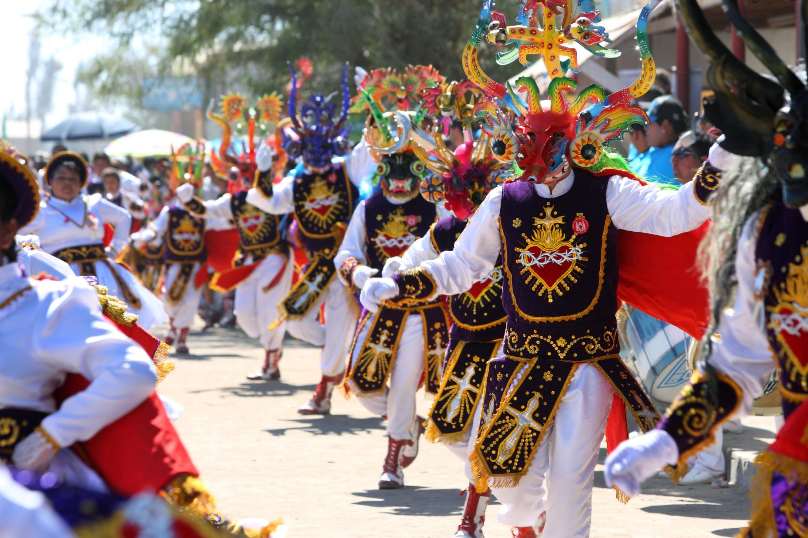

## Capstone Project Proposal
---
#### Nelia Terrazas
#### 5/3/19

### Project Description
Name of Project: Space Matters Site

Project’s Purpose or Goal: Survey Site Designed to Display Derrick McDonald's Work for Space Matters.

Minimum 

Sign in/sign out. Google Authentication.

Interactive splash page introducing 3 different color selections.

Prompt questions for users to answer.

Collecting data.

Sending and calling back data from database.

Translating data into simple design.

Site hosting from .design so use can begin immeadiately.

What tools, frameworks, libraries, APIs, modules and/or other resources (whatever is specific to your track, and yourlanguage) will you use to create this MVP? List them all here. Be specific.

React

Firebase

Google Authentication

If you finish developing the minimum viable product (MVP) with time to spare, what will you work on next? Describe these features here: Be specific.

Dive in deeper with different design options.

User is able to delete/edit announcements/ overall entries.

Add social media sharing capabilities.

Analytics: long term data collection displayed as interactive charts and graphs.

What additional tools, frameworks, libraries, APIs, or other resources will these additional features require?

Explore social plug ins.

More in depth exploration of Firebase.

Is there anything else you’d like your instructor to know?

I have met with Derrick McDonald, have permission to use his name and group name, and will continue to work with his group until the site is polished and completed to all of our specifications.

#### Manual Commit History
8AM-9AM: Initial set up and exploration (elaborate)
9AM-10AM: UX research, brainstorm, colors on Adobe Colors (take screenshots!)
10AM-11AM: React and Firebase exploration
11AM-12PM:
12PM-1PM:
1PM-2PM:
2PM-3PM:
3PM-4PM:
4PM-5PM:s

#### Desktop Version:

#### Tablet version:

#### Mobile Version:

### Images:

Initial Photos for Color Families:

### User Personas

### User Stories

### Research, Inspiration, and Brainstorm

For my inspiration, I looked at coworking spaces and coffee shops around Portland. After looking at a lot of sites that seemed to fit with the look and feel that the client was trying to convey. With attention to images, margins, font, fluidity, color choices, and use of logos, I developed an idea for the overall look of the client's site.

### Technologies and Resources

* Sketch
* HTML
* CSS
* Sass

### Responsiveness

Webpages will read just nav bar display, image size, and main container layout as the viewport changes sizes. There are 3 main viewports in mind: mobile, tablet and desktop.

### Setup Instructions

* Download this repository at https://github.com/neliaterrazas/freelance-project.git
* $ npm install in the terminal to retrieve node_modules folder
* $ npm run build in the terminal to retrieve dist folder
* Open in your favorite text editor to see said folders
* $ npm run start to open a new tab with the live site/ compile code.

### Roadmap
I would like to continue building out the amenities and how to join pages for all versions, as all of my 4 remaining hours was spent on styling and building out the index page as planned out on my wireframe. The amenities page is where I plan to use grid to my full advantage, especially with media queries, to integrate all the icons I made on Sketch.

### License

MIT License

Copyright (c) 2019 **_Nelia Terrazas_**
